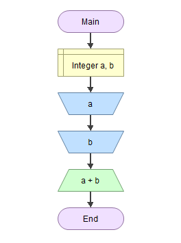

# Линијске програмске струткруре и алгоритми

Алгоритми линијске (просте) структуре састоје се од низа серијски компонованих алгоритамских корака. Након извршења једног алгоритамском корака, увек се прелази на први следећи корак, све док се не заврши алгоритам.

На пример, потребно је осмислити алгоритамску шему и написати програм у програмском језику C за испис збира два унета цела броја.



Када започне извршавање алгоритма, редом се извршавају дефинисани алгоритамски кораци: декларишу се променљиве `a` и `b`, чита се вредност променљиве `a`, чита се вредност променљиве `b` и на крају исписује збир `a + b`. Не постоји могућност да се неки корак прескочи или понови.

```c
#define _CRT_SECURE_NO_WARNINGS
#include <stdio.h>

int main(void)
{
    int a, b;
    scanf("%d", &a);
    scanf("%d", &b);
    printf("%d", a + b);
    return 0;
}
```

Више задатака са линијском структуром алгоритма налази се у Збирци.
