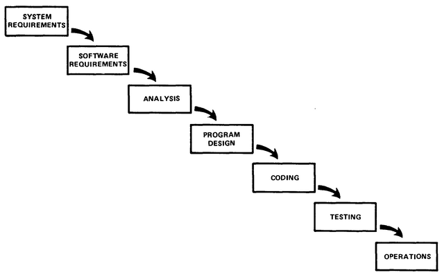

# Животни циклус развоја софтвера

Процес представља скуп активности које се извршавају да би се добио одређени резултат. У оквиру наставног предмета Програмирање бавићемо се процесом који представља скуп активности које се извршавају приликом развоја софтвера. Овај процес назива се животним циклусом развоја софтвера *(енгл. SDLC - Software Development Life Cycle)*.

На почеку, са мало планирања, програмер је самостално могао да произведе функционалан софтвер. Како су захтеви корисника софтвера расли, а софтвер постајао све сложенији, на његовој изради и доради морало је радити више програмера истовремено. Због тога су осмишљене методологије развоја софтвера које се баве организацијом рада тима, груписањем активности, доношењем правила, креирањем шаблона итд. Методологијама животног циклуса развоја софтвера бави се дисциплина софтверског инжењерства.

## Модел водопада

Једна од првих методологија развоја софтвера представљена је моделом водопада *(енгл. [Waterfall Model](http://www-scf.usc.edu/~csci201/lectures/Lecture11/royce1970.pdf), Royce 1970.)*. Модел водопада подразумевао је следеће фазе:

Иако је модел настао пре више од педесет година, ове фазе можемо применити и данас:

1. **Системски захтеви.** У првој фази треба одговорити на следећа питања: Која је платформа на којој ће се програм извршавати? Која се хардверска архитектура користи, који оперативни систем, који је додатан софтвер неопходан?
2. **Софтверски захтеви.** У другој фази треба одговорити на следећа питања: Шта софтвер треба да ради? У којој су форми улазни подаци, а у којој резултати? Која су и каква су ограничења?
3. **Анализа:** У трећој фази проблем се раставља на целине. Израђују се алгоритми (идејна решања) којима се дефинише како програм треба да изврши дефинисане задатке.
4. **Дизајн програма.** У четвртој фази осмишљава се кориснички интерфејс.
5. **Кодирање.** Тек када су претходне фазе завршене, долази до пете фазе - уноса изворног програма, дебаговања и превођење у извршни програм.
6. **Тестирање.** У шестој фази тестирају се све функције програма и израђује се програмска документација.
7. **Употреба.** Седма фаза подразумева испоруку и инсталацију програма, оперативно коришћење програма од стране корисника и одржавање програма.

У пракси, након уочавања проблема у одређеној фази, програмери су се често враћали на претходне фазе. То је условило да се развију напредније методологије као што су: рапидни развој, развој вођен тестовима, агилни развој (скрам, адаптивни развој, развој вођен карактеристикама, динамички развој, екстремно програмирање), и др.

## Питања за проверу знања

1. Шта се подразумева под “животним циклусом развоја софтвера”?
2. Чиме се баве методологије развоја софтвера?
3. Које фазе има модел водопада? Покушај да укратко опишеш сваку фазу појединачно.
4. Шта је главни недостатак модела водопада?
5. Наведи неколико напреднијих методологија развоја софтвера.

## Домаћи задатак

Истражите једну методологију развоја софтвера која се данас често користи.